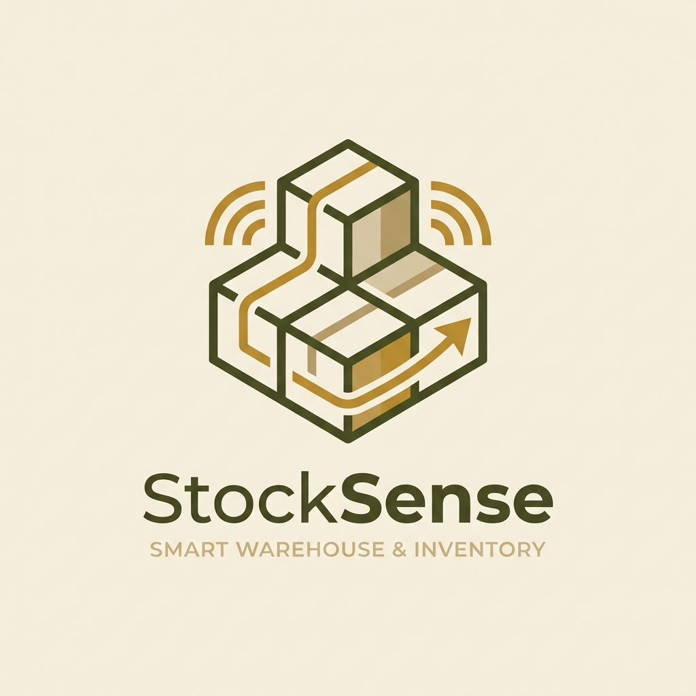
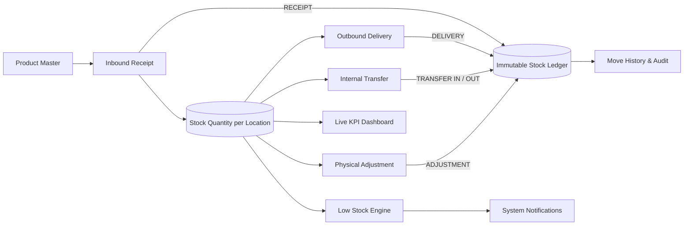
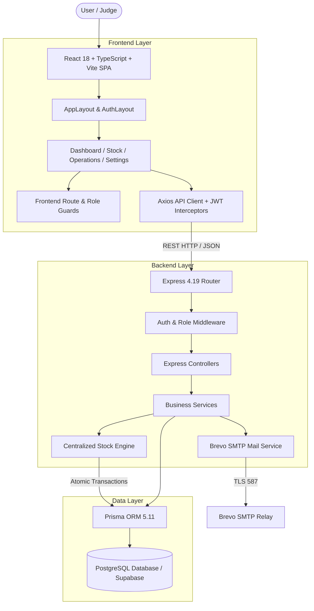
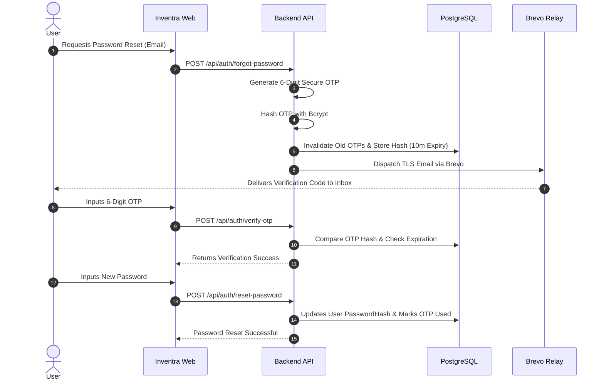
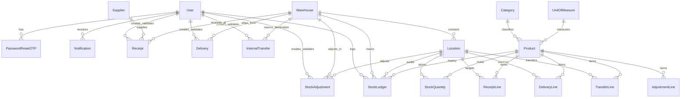

<p align="center">
  
</p>

<h1 align="center">Inventra</h1>

<p align="center">
  <strong>Smart Inventory. Complete Control.</strong><br />
  A modern, location-aware Inventory & Warehouse Management Platform engineered with transactional stock integrity, immutable audit ledgers, role-based access control, and real-time operational workflows.
</p>

<p align="center">
  
  
  
  
  
  
  
  
  
  
</p>

<p align="center">
  <code>Hackathon Project • Enterprise Inventory & Warehouse Management System</code>
</p>

---

## 📑 Table of Contents

- [Overview](#-overview)
- [The Problem](#-the-problem)
- [Our Solution](#-our-solution)
- [Key Features](#-key-features)
- [Inventory Lifecycle](#-inventory-lifecycle)
- [System Architecture](#-system-architecture)
- [Backend Architecture](#-backend-architecture)
- [Stock Management Engine](#-stock-management-engine)
- [Authentication & Password Recovery](#-authentication--password-recovery)
- [Database Architecture](#-database-architecture)
- [Repository Structure](#-repository-structure)
- [Technology Stack](#-technology-stack)
- [Quick Start](#-quick-start)
- [Environment Variables](#-environment-variables)
- [Database Setup](#-database-setup)
- [Demo Accounts](#-demo-accounts)
- [API Reference](#-api-reference)
- [Judge Demo Flow](#-judge-demo-flow)
- [Security](#-security)
- [Testing & Verification](#-testing--verification)
- [UI / Design System](#-ui--design-system)
- [Future Improvements](#-future-improvements)
- [Why Inventra?](#-why-inventra)
- [License](#-license)

---

## 🌟 Overview

**Inventra** is an enterprise-grade inventory and warehouse management system designed to eliminate inventory blindspots, reconcile physical stock with system records, and prevent accidental stock deficits.

Unlike rudimentary inventory trackers that treat stock as a simple counter on a product table, Inventra treats stock as **location-aware physical state** governed by a centralized **Stock Engine** and an **immutable, append-only Stock Ledger**. Every inbound receipt, outbound customer shipment, inter-warehouse transfer, and physical count adjustment is executed within atomic database transactions to guarantee mathematical consistency across all locations.

---

## 🚨 The Problem

Modern multi-facility supply chains face recurring operational risks that lead to lost revenue and customer dissatisfaction:

1. **Fragmented Inventory Information**: Stock counts scattered across separate spreadsheets without real-time synchronization.
2. **Lack of Location Granularity**: Knowing that a company owns 100 units of an item, but not knowing which warehouse, aisle, or rack holds them.
3. **Manual Stock Updates & Human Error**: Staff manually overwriting stock counters without recording who made the change or why.
4. **Accidental Negative Stock**: Orders processed without verifying physical availability, resulting in fulfillment failure and stockouts.
5. **Painful Physical Reconciliation**: Count variances discovered during periodic audits cannot be cleanly traced back to their root causes.
6. **No Audit Trail**: Lack of historical ledger movements making compliance and fraud investigation impossible.
7. **Delayed Low-Stock Awareness**: Reorder points breached without prompt, actionable notification to inventory procurement managers.

---

## 💡 Our Solution

Inventra addresses these challenges through a unified, ERP-inspired platform:

1. **Centralized Multi-Warehouse Management**: Full topology modeling from physical warehouses down to individual storage bins and staging docks.
2. **Location-Level Inventory Quantities**: Authoritative stock quantities stored strictly per `(product, location)` pair.
3. **Controlled State-Machine Documents**: Formal document lifecycles (`DRAFT` $\to$ `READY` $\to$ `DONE` / `CANCELED`) for receipts, deliveries, transfers, and adjustments.
4. **Zero-Floor Transaction Safety**: Strict database-level verification preventing stock from dropping below zero.
5. **Immutable Stock Ledger**: Every inventory mutation produces an auditable ledger record containing delta, balance after, reference document, timestamp, and user attribution.
6. **Physical Count Reconciliation**: First-class inventory adjustments that calculate count variances ($\Delta = \text{Counted} - \text{Recorded}$) and record audit deltas.
7. **Automated Low-Stock Detection**: Real-time evaluation of reorder thresholds generating centralized alerts and duplicate-prevented notifications.
8. **Live KPI Dashboard**: Instant visibility into stock health, pending operations, inventory valuation, and movement velocity.
9. **Role-Based Access Control (RBAC)**: Distinct interfaces and API permission guards for `ADMIN`, `INVENTORY_MANAGER`, and `WAREHOUSE_STAFF`.
10. **Secure OTP Password Recovery**: Cryptographically secure 6-digit OTP delivery via Brevo SMTP relay with rate limiting and expiration guards.

---

## 🚀 Key Features

### 📦 Product Master Catalog
- Unique SKU codes with custom category grouping and standardized Units of Measure (UOM).
- Reorder point thresholds and per-unit purchase valuation for financial tracking.
- Multi-dimensional search, status filters (Normal, Low Stock, Out of Stock), and active/archived state toggles.

### 🏭 Warehouse & Location Topology
- Hierarchical modeling: **Facility (Warehouse)** $\to$ **Storage Zone (Location)**.
- Specialized location types: `INTERNAL` (General Storage), `INPUT` (Receiving Dock), `OUTPUT` (Dispatch Bay), and `SCRAP` (Quarantine).
- Delete protection preventing the removal of locations or warehouses with active inventory or historical ledger lines.

### 📥 Inbound Receipts
- Vendor purchase order receiving workflow: `DRAFT` $\to$ `READY` $\to$ `DONE`.
- Validation atomically increments `StockQuantity` in the target destination location and records an auditable `RECEIPT` ledger entry.

### 📤 Outbound Delivery Orders
- Customer fulfillment workflow: `DRAFT` $\to$ `WAITING` $\to$ `READY` $\to$ `DONE`.
- Real-time stock availability verification showing exact available quantities and shortage warnings.
- Validation atomically decrements `StockQuantity` and records a `DELIVERY` ledger entry.

### 🔄 Internal Warehouse Transfers
- Inter-location and inter-warehouse stock rebalancing: `DRAFT` $\to$ `READY` $\to$ `DONE`.
- Decrements source location stock and increments destination location stock atomically, preserving overall company balance while producing paired `TRANSFER_OUT` and `TRANSFER_IN` audit records.

### 🧮 Inventory Adjustments & Direct Stock Updates
- Physical cycle count reconciliation: $\text{Delta} = \text{Counted Quantity} - \text{Recorded Quantity}$.
- Direct stock updates from the Stock table with live delta projection and two-step confirmation.
- Generates `ADJUSTMENT` ledger records reflecting exact positive (gain) or negative (loss) variances.

### 📜 Immutable Stock Movement Ledger & Audit
- Comprehensive movement log tracking timestamp, product SKU, source/target warehouse and location, operation type, signed quantity change, balance after mutation, document reference, and responsible user.
- Interactive Table and Kanban views with multi-criteria filtering by date range, warehouse, and operation type.

### 📊 Live Analytics Dashboard
- Key performance metrics: Total Products, Low Stock Count, Out of Stock Count, Pending Receipts, Pending Deliveries, and Scheduled Transfers.
- Recent movements feed, critical stock alerts table, and operational shortcut cards.

### 🔐 Enterprise Authentication & RBAC
- Passwords hashed using Bcrypt (10 salt rounds), signed JSON Web Tokens (JWT) for stateless session security.
- Comprehensive RBAC enforcing separation of duties between Administrator, Inventory Manager, and Warehouse Staff.
- 6-digit cryptographic OTP generation delivered via Brevo SMTP relay with a 30-second resend cooldown and 10-minute expiration.

---

## 🔄 Inventory Lifecycle



---

## 🏗️ System Architecture



---

## ⚙️ Backend Architecture

Every incoming request passes through a structured, multi-tier pipeline:

```text
HTTP Request
  └── Route Handler (/api/*)
        └── Authentication Middleware (JWT Validation & Token Decoding)
              └── Role Authorization Middleware (ADMIN / INVENTORY_MANAGER / WAREHOUSE_STAFF)
                    └── Input Validation Middleware (Zod / Joi Schema Check)
                          └── Controller Layer (Request Parsing & Response Formatting)
                                └── Service Layer (Business Logic & State Transitions)
                                      └── StockEngineService (Atomic Stock & Ledger Mutations)
                                            └── Prisma ORM Client
                                                  └── PostgreSQL / Supabase Database
```

- **Separation of Concerns**: Controllers only handle HTTP orchestration; all inventory business rules, state machines, and mathematical calculations reside strictly in the Service layer.
- **Zero Client-Side Authoritative Mutation**: The frontend never updates stock quantities directly; it only submits document requests (`Receipt`, `Delivery`, `Transfer`, `Adjustment`) that the backend validates and executes.

---

## ⚡ Stock Management Engine

The core invariant of Inventra is that **stock is strictly physical and location-bound**.

$$\text{Product} + \text{Location} \implies \text{StockQuantity}$$

### Authoritative Stock Quantities vs. Product Master
The `Product` table stores catalog attributes (SKU, name, cost, reorder point). The `StockQuantity` table holds the authoritative on-hand balance for a product inside a specific warehouse location.

### Transactional Atomicity
Stock changes and ledger records are committed together in atomic transactions (`prisma.$transaction`). If any database write fails, the entire transaction rolls back.

```typescript
// Conceptual Atomic Stock Mutation
await prisma.$transaction(async (tx) => {
  // 1. Update physical location balance
  const updatedStock = await tx.stockQuantity.upsert({ ... });
  
  // 2. Append immutable audit ledger record
  await tx.stockLedger.create({
    data: {
      productId,
      warehouseId,
      locationId,
      operationType,
      quantity: delta,
      balanceAfter: updatedStock.quantity,
      referenceId,
      createdBy: userId,
    }
  });
});
```

### Operation Balance Examples

| Operation | Before | Mutation | After | Total Company Balance | Ledger Entry |
| :--- | :---: | :---: | :---: | :---: | :--- |
| **Receipt** | `MAIN: 100` | $+50$ | `MAIN: 150` | $100 \to 150$ | `RECEIPT (+50)` |
| **Delivery** | `MAIN: 150` | $-20$ | `MAIN: 130` | $150 \to 130$ | `DELIVERY (-20)` |
| **Transfer** | `WH1: 100`, `WH2: 20` | $-30$ / $+30$ | `WH1: 70`, `WH2: 50` | $120 \to 120$ | `TRANSFER_OUT (-30)` & `TRANSFER_IN (+30)` |
| **Adjustment** | `MAIN: 100` | Physical Count = $95$ | `MAIN: 95` | $100 \to 95$ | `ADJUSTMENT (-5)` |

### Free to Use vs. On Hand Stock
- **On Hand**: Physical inventory physically resting in the location.
- **Reserved Stock**: Sum of demand quantities in active `WAITING` and `READY` delivery lines and transfer lines.
- **Free to Use**: Inventory available for immediate allocation:

$$\text{Free to Use} = \max(0, \text{On Hand} - \text{Reserved})$$

---

## 🔒 Authentication & Password Recovery

Inventra implements secure credential management and password recovery:



### Security Safeguards
- **Cryptographic OTP Generation**: 6-digit random integers with 10-minute expiration.
- **Hash-at-Rest**: OTP values are hashed using Bcrypt before database storage.
- **Rate-Limiting Cooldown**: 30-second cooldown between OTP generation requests to prevent mail server abuse.
- **Single-Use Guard**: OTP records are marked as used immediately upon validation.

---

## 🗄️ Database Architecture

Inventra utilizes PostgreSQL managed with Prisma ORM.



### Core Schema Entities

| Entity | Description | Authoritative Relationships |
| :--- | :--- | :--- |
| `User` | User account credentials, names, and assigned role (`ADMIN`, `INVENTORY_MANAGER`, `WAREHOUSE_STAFF`). | Referenced by all operational documents and ledger entries. |
| `Product` | Master catalog record (SKU, title, category, UOM, per-unit cost, reorder point threshold). | Belongs to `Category` and `UnitOfMeasure`. |
| `Warehouse` | Physical facility entity with code, name, and street address. | Has many `Location` records. |
| `Location` | Specific storage zone (Internal, Input Dock, Output Bay, Scrap). | Belongs to a parent `Warehouse`. |
| `StockQuantity` | Current on-hand quantity for a product in a location (`@@unique([productId, locationId])`). | Joint relation between `Product` and `Location`. |
| `Receipt` & `ReceiptLine` | Inbound supplier shipment document and line items. | References `Supplier`, `Warehouse`, and destination `Location`. |
| `Delivery` & `DeliveryLine` | Outbound customer sales shipment document and line items. | References `Warehouse` and source `Location`. |
| `InternalTransfer` & `TransferLine`| Inter-warehouse / inter-location transfer document and line items. | References source and destination `Warehouse` and `Location`. |
| `StockAdjustment` & `AdjustmentLine` | Physical inventory count variance reconciliation document. | References `Warehouse` and target `Location`. |
| `StockLedger` | Append-only audit record created on every stock-altering event. | Captures signed delta, balance after, and document reference. |
| `Notification` | Low stock and out of stock system alerts. | Dispatched to authorized system users. |
| `PasswordResetOTP` | Hashed 6-digit one-time password records with expiration timestamps. | Belongs to `User`. |

---

## 📂 Repository Structure

```text
Inventra/
├── database/                    # Database Layer (Prisma & Seeds)
│   ├── prisma/
│   │   ├── schema.prisma        # Authoritative Prisma Schema (18 Models)
│   │   └── migrations/          # Version-controlled SQL migration files
│   ├── seed/
│   │   └── seed.ts              # Deterministic database seeding script
│   └── src/                     # Database client export package
│
├── backend/                     # Backend API (Node.js + Express + TypeScript)
│   ├── src/
│   │   ├── config/              # Environment & Prisma client setup
│   │   ├── controllers/         # HTTP request orchestration
│   │   ├── middleware/          # Auth, RBAC, error & validation middleware
│   │   ├── routes/              # Express API route declarations
│   │   ├── services/            # Core business logic & StockEngineService
│   │   ├── utils/               # Brevo mail relay, JWT & OTP helpers
│   │   ├── validators/          # Zod / Joi validation schemas
│   │   └── app.ts               # Express server bootstrap
│   └── package.json
│
├── frontend/                    # Frontend SPA (React 18 + Vite + TypeScript)
│   ├── src/
│   │   ├── components/          # Reusable UI (Sidebar, Topbar, Modal, EmptyState)
│   │   ├── context/             # AuthContext & ToastContext
│   │   ├── layouts/             # AppLayout & AuthLayout
│   │   ├── pages/               # Page views (Dashboard, Stock, Operations, Settings)
│   │   ├── services/            # Axios API clients (stockApi, operationApi, etc.)
│   │   ├── index.css            # Inventra design system tokens & styles
│   │   └── App.tsx              # React Router & RBAC Route Guards
│   └── package.json
│
├── docs/                        # Project documentation & visual assets
├── LICENSE                      # MIT Open-Source License
├── CODE_OF_CONDUCT.md           # Contributor Covenant Code of Conduct
├── SECURITY.md                  # Security Policy & Vulnerability Reporting
├── package.json                 # Monorepo Workspace Configuration
└── README.md                    # Project Documentation
```

---

## 🛠️ Technology Stack

| Layer | Technology | Version | Purpose in Inventra |
| :--- | :--- | :--- | :--- |
| **Frontend Framework** | React | `^18.3.1` | Component-driven user interface |
| **Language** | TypeScript | `^5.4.5` | End-to-end type safety across client and server |
| **Build Tooling** | Vite | `^6.0.0` | Ultra-fast development server & production bundler |
| **Routing** | React Router | `^6.22.3` | Client-side routing with RBAC Route Guards |
| **Icons & Visuals** | Lucide React | `^0.359.0` | Enterprise icon system |
| **Backend Framework**| Node.js + Express | `^4.19.2` | REST API routing and middleware orchestration |
| **ORM** | Prisma | `^5.11.0` | Type-safe database queries, migrations, and transactions |
| **Database** | PostgreSQL / Supabase | `15` | Relational data store for inventory records |
| **Authentication** | JWT + Bcrypt | `^9.0.2` | Cryptographic password hashing and signed bearer tokens |
| **Email Relay** | Brevo SMTP (Nodemailer) | `^6.9.13` | OTP email dispatch for password recovery |
| **Monorepo Tools** | NPM Workspaces | `10.x` | Multi-package workspace orchestration |

---

## 🚦 Quick Start

### Prerequisites
- **Node.js**: v18.0.0 or higher (`node -v`)
- **npm**: v9.0.0 or higher (`npm -v`)
- **PostgreSQL Database**: Supabase instance or local PostgreSQL 15+

---

### Step 1: Clone the Repository
```bash
git clone https://github.com/harshit-kumar-dev/Inventra.git
cd Inventra
```

### Step 2: Install Monorepo Dependencies
```bash
npm install
```

### Step 3: Configure Environment Variables
Create `.env` in the root directory (and `backend/.env`):
```bash
cp .env.example .env
```

---

## 🔐 Environment Variables

### Root / Backend `.env`
```env
# Database Connection (Supabase / PostgreSQL)
DATABASE_URL="postgresql://postgres:[PASSWORD]@[HOST]:5432/postgres?schema=public"

# Server Configuration
PORT=5000
NODE_ENV=development
FRONTEND_URL="http://localhost:5173"

# Authentication Secrets
JWT_SECRET="your-super-secret-jwt-key-min-32-chars-long"
JWT_EXPIRES_IN="7d"

# Brevo SMTP Configuration (for password reset OTP)
BREVO_SMTP_HOST="smtp-relay.brevo.com"
BREVO_SMTP_PORT=587
BREVO_SMTP_USER="your-brevo-smtp-login-email"
BREVO_SMTP_PASSWORD="your-brevo-smtp-master-key"
BREVO_SENDER_EMAIL="verified-sender@inventra.app"
BREVO_SENDER_NAME="Inventra"
```

### Frontend `.env` (`frontend/.env`)
```env
VITE_API_URL="http://localhost:5000/api"
```

---

## 🗃️ Database Setup

Run the following commands from the root directory to generate the Prisma client, apply database schemas, and seed realistic inventory demo data:

```bash
# 1. Generate Prisma Client
npm run db:generate

# 2. Push Schema to Database (or run migrations)
npm run db:push

# 3. Seed Realistic Inventory, Operations & Demo Users
npm run db:seed
```

### Starting the Development Environment
```bash
# Starts both Backend (Port 5000) and Frontend (Port 5173) concurrently
npm run dev
```

Open your browser and navigate to `http://localhost:5173`.

---

## 👥 Demo Accounts

The database seed provides predefined accounts covering all three enterprise roles:

| Role | Email / Login ID | Password | Access Level & Permissions |
| :--- | :--- | :--- | :--- |
| **System Administrator** | `admin` *(or `harshit81k@gmail.com`)* | `Password@123` | **Full Access**: Settings, Warehouses, Locations, Products, Operations, Stock Adjustments, User Management. |
| **Inventory Manager** | `manager@inventra.com` *(or `manager1`)* | `Password@123` | **Operations & Master Access**: Receipts, Deliveries, Transfers, Adjustments, Stock Ledger, Products, Warehouses, Locations. |
| **Warehouse Staff** | `staff@inventra.com` *(or `warehouse1`)* | `Password@123` | **Floor Operations**: Transfers, Picking (Deliveries), Physical Counts, Draft Receiving. Settings routes blocked. |

*Tip: The login page includes 1-click **Quick Fill Demo Credentials** buttons for instant evaluation.*

---

## 📡 API Reference

### Authentication & Recovery (`/api/auth`)
| Method | Endpoint | Description | Protected |
| :--- | :--- | :--- | :---: |
| `POST` | `/api/auth/register` | Register new Administrator account | Public |
| `POST` | `/api/auth/login` | Login with email/loginId and password | Public |
| `GET` | `/api/auth/me` | Fetch active user session profile | Bearer Token |
| `POST` | `/api/auth/forgot-password` | Request password reset OTP via Brevo | Public |
| `POST` | `/api/auth/verify-otp` | Verify 6-digit OTP code | Public |
| `POST` | `/api/auth/reset-password` | Set new password with valid OTP | Public |

### Stock Management (`/api/stock`)
| Method | Endpoint | Description | Protected |
| :--- | :--- | :--- | :---: |
| `GET` | `/api/stock` | Query stock with location and warehouse filters | Authenticated |
| `GET` | `/api/stock/alerts` | Fetch Low Stock and Out of Stock alerts | Authenticated |
| `GET` | `/api/stock/ledger` | Fetch immutable stock movement history | Authenticated |
| `GET` | `/api/stock/products/:productId` | Query stock distribution for a product | Authenticated |

### Inventory Operations (`/api/receipts`, `/api/deliveries`, `/api/transfers`, `/api/adjustments`)
| Method | Endpoint | Description | Role Required |
| :--- | :--- | :--- | :---: |
| `GET` | `/api/receipts` | List inbound vendor receipts | All Roles |
| `POST` | `/api/receipts` | Create inbound receipt document | All Roles |
| `POST` | `/api/receipts/:id/validate` | Validate receipt (increments stock & logs ledger) | Manager / Admin |
| `GET` | `/api/deliveries` | List outbound delivery orders | All Roles |
| `POST` | `/api/deliveries` | Create outbound delivery document | All Roles |
| `POST` | `/api/deliveries/:id/validate`| Validate delivery (decrements stock & logs ledger)| Manager / Admin |
| `POST` | `/api/transfers/:id/validate` | Validate transfer (rebalances stock across locations)| Manager / Admin |
| `POST` | `/api/adjustments` | Create physical inventory adjustment draft | All Roles |
| `POST` | `/api/adjustments/:id/validate`| Validate adjustment (applies delta & logs ledger) | Manager / Admin |

### Settings & Master Data (`/api/warehouses`, `/api/products`, `/api/users`)
| Method | Endpoint | Description | Role Required |
| :--- | :--- | :--- | :---: |
| `GET` | `/api/warehouses` | List warehouse facilities | Manager / Admin |
| `POST` | `/api/warehouses` | Register new warehouse facility | Manager / Admin |
| `DELETE`| `/api/warehouses/:id` | Delete warehouse (protected by constraint check) | Manager / Admin |
| `GET` | `/api/warehouses/locations/all` | List storage zones & racks | Manager / Admin |
| `POST` | `/api/warehouses/locations` | Register new storage location | Manager / Admin |
| `DELETE`| `/api/warehouses/locations/:id` | Delete location (protected by stock check) | Manager / Admin |
| `GET` | `/api/users` | List system users and roles | Admin Only |
| `PUT` | `/api/users/:id/role` | Update user role assignment | Admin Only |

---

## 🎯 Judge Demo Flow

*A structured 4-minute walkthrough designed for evaluating Inventra:*

1. **Sign In**: Open `http://localhost:5173/login`, click **Fill Admin**, and click **Sign In**.
2. **Dashboard Overview**: Inspect live KPIs: Total Products, Low Stock alerts, Out of Stock warnings, and Recent Movements ledger feed.
3. **Stock Inventory & Free-to-Use**: Navigate to **Stock** (`/stock`). View on-hand quantities, per-unit costs, and available free-to-use balance.
4. **Direct Stock Adjustment**:
   - Click **Update** on any product row (e.g. *Corrugated Packaging Boxes*).
   - Change quantity from `30` $\to$ `35` ($+5$ Gain) with reason *"Periodic audit count"*.
   - Confirm update. Notice instant table update without page reload.
5. **Inbound Goods Receipt**:
   - Navigate to **Incoming Receipts** (`/receipts`). Click **+ New Receipt**.
   - Select Supplier, Warehouse, and Add Line (e.g., $20$ units of *Steel Bolts*).
   - Click **Mark as Ready** $\to$ **Validate & Receive**.
   - Observe automatic stock increment and status transition to `DONE`.
6. **Outbound Customer Delivery**:
   - Navigate to **Outgoing Deliveries** (`/deliveries`). Click **+ New Delivery**.
   - Select Customer and Destination. Check live stock availability badges.
   - Click **Validate & Deliver** to deduct physical stock.
7. **Stock Movement Ledger**:
   - Navigate to **Stock Ledger & Audit** (`/move-history`).
   - Switch between **Table View** and **Kanban View**.
   - Verify that your Receipt ($+20$), Delivery ($-10$), and Adjustment ($+5$) records appear with exact timestamps and signed deltas.
8. **Settings & Role-Based Access Control (RBAC)**:
   - Go to **Settings Hub** (`/settings`) $\to$ **Warehouse** & **Locations**.
   - Sign out and log in as **Warehouse Staff** (`staff@inventra.com`).
   - Notice Settings is hidden. Attempting direct navigation to `/settings` redirects safely to `/dashboard`, and backend APIs return `403 Forbidden`.

---

## 🛡️ Security

- **Role-Based Access Control**: Dual-layer authorization enforced both at the React Router layer and Express route level.
- **Zero-Floor Stock Protection**: Database transactions reject operations that would cause negative inventory balances.
- **Bcrypt Password Security**: Passwords hashed with 10 salt rounds; plaintext passwords never saved or logged.
- **Stateless JWT Authorization**: Bearer tokens verified on every protected API call.
- **Secure OTP Lifecycle**: Single-use 6-digit tokens hashed in the database with strict 10-minute expiry and 30-second rate-limiting cooldowns.
- **Environment Isolation**: Database connection strings, JWT secrets, and SMTP credentials reside strictly server-side.

---

## 🧪 Testing & Verification

- **Prisma Schema & Migrations**: Validated with zero drift.
- **Backend TypeScript Compilation**: Compiled cleanly (`npm run --workspace=backend build` $\implies$ `0 errors`).
- **Frontend Vite Production Bundle**: Transformed 1,638 modules and bundled successfully (`npm run --workspace=frontend build` $\implies$ `0 errors`).
- **Automated Stock Engine Verification**: Tested $+5$ gain and $-5$ loss adjustments against atomic transaction rollback and negative quantity guards.
- **RBAC API Verification**: Automated tests verified that `ADMIN` and `INVENTORY_MANAGER` tokens access settings while `WAREHOUSE_STAFF` tokens receive `403 Forbidden`.

---

## 🎨 UI / Design System

Inventra utilizes an enterprise palette designed for readability and focus:

| Token | Hex Value | Application |
| :--- | :---: | :--- |
| **Primary (Olive Forest)** | `#4F5B2A` | Brand headers, primary buttons, active navigation, key icons |
| **Accent (Warm Ochre)** | `#B8892D` | Highlights, badges, adjustment gains, interactive accents |
| **Background (Parchment Cream)**| `#F5EFE3` | Main page background, subtle card backdrops |
| **Surface Border (Soft Khaki)** | `#D8C9A8` | Table borders, input borders, structural dividers |
| **Card Surface (Pure White)** | `#FFFFFF` | Data tables, form cards, modal containers |

---

## 🔮 Future Improvements

1. **Barcode & QR Scanning**: Integrated mobile camera barcode scanner for rapid receiving dock check-in and pick-list verification.
2. **Automated Purchase Orders**: Automatic generation of supplier draft purchase orders when products cross reorder thresholds.
3. **Advanced Forecast Analytics**: Moving-average consumption velocity modeling to project days-until-stockout.
4. **PDF Document Generation**: Downloadable formal Goods Receipt Notes (GRN) and Delivery Packing Slips with barcodes.
5. **Multi-Tenant Enterprise Partitioning**: Organization-scoped isolation for multi-company logistics operators.

---

## 🏆 Why Inventra?

- **Real-World Inventory Mechanics**: Implements true location-based inventory rather than oversimplified product counters.
- **Guaranteed Transaction Safety**: Atomically binds stock mutations to an immutable audit ledger.
- **Production-Ready Architecture**: Built on robust standards: React 18, TypeScript, Express, Prisma, and PostgreSQL.
- **Zero Mock Data**: Fully backed by persistent database schemas and deterministic realistic seed datasets.

---

## 📄 License

Distributed under the **MIT License**. See [`LICENSE`](file:///c:/Users/Harshit%20kumar/OneDrive/Desktop/Hackathon/04.only_odoo/Inventra/LICENSE) for complete details.

---

<p align="center">
  Built with ❤️ for the Hackathon using React, Node.js, Prisma & PostgreSQL
</p>

<p align="center">
  <strong>Inventra</strong> — <em>Smart Inventory. Complete Control.</em>
</p>